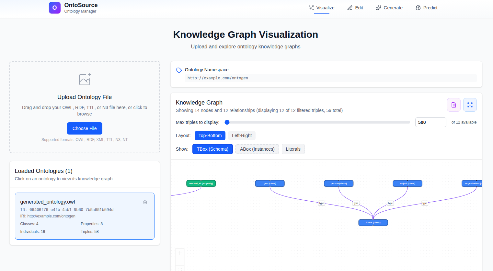
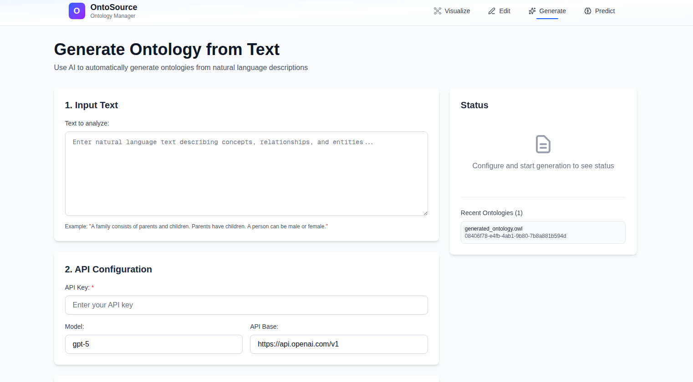

# OntoSource

An web-based platform for ontology engineering and knowledge graph exploration - intuitive editing, visualization, and reasoning, powered by [OWLAPY](https://github.com/dice-group/owlapy).




"

## Prerequisites

- Conda (Anaconda or Miniconda)
- Node.js 18+
- npm or pnpm

## Quick Start

Run the entire project with a single command:

```bash
./start.sh
```

This script will:
- Create the conda environment if it doesn't exist
- Install all dependencies
- Start both backend and frontend services
- Display all service URLs

Press `Ctrl+C` to stop all services.

## Manual Setup

### Backend (FastAPI)

```bash
# Create conda environment with Python 3.13.7
conda create -n ontosource python=3.13.7 -y

# Activate the environment
conda activate ontosource

# Install Python dependencies
pip install -r requirements.txt

# Navigate to services directory
cd services

# Run the API server
uvicorn main:app --reload
```

The API will be available at `http://localhost:8000`. API documentation at `http://localhost:8000/docs`.

### Frontend (Next.js)

```bash
# Navigate to webapp directory
cd webapp

# Install dependencies
npm install
# or
pnpm install

# Run development server
npm run dev
# or
pnpm dev
```

The webapp will be available at `http://localhost:3000`.

## Features

- **Ontology Generation**: AI-powered ontology creation from natural language descriptions
- **Import & Export**: Support for OWL/RDF formats (.owl, .rdf, .xml, .ttl, .n3, .nt)
-️ **Interactive Editing**: Full CRUD operations for classes, properties, individuals, and axioms
- **Knowledge Graph Visualization**: Interactive graph rendering with react-flow 
- **Classical Reasoning**: Inference of instances, sub/super classes, and entity types
- **Neural Reasoning**: Embedding-based reasoning (EBR) 
- **Multi-Ontology Management**: Upload, store, and switch between multiple ontologies
- **Entity Explorer**: Browse and analyze ontology entities with detailed summaries

## API Endpoints

- `/generate` - AI-powered ontology generation from text
- `/ontology` - Upload, list, and manage ontologies
- `/modify` - Create and edit ontology entities and axioms
- `/reasoning` - Perform logical reasoning (instances, sub/super classes, types)
- `/neural-reasoning` - Neural embedding-based reasoning

For full API documentation, visit `http://localhost:8000/docs` when running the backend.

